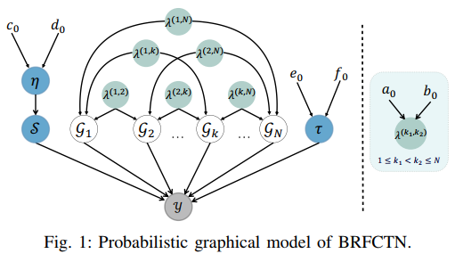
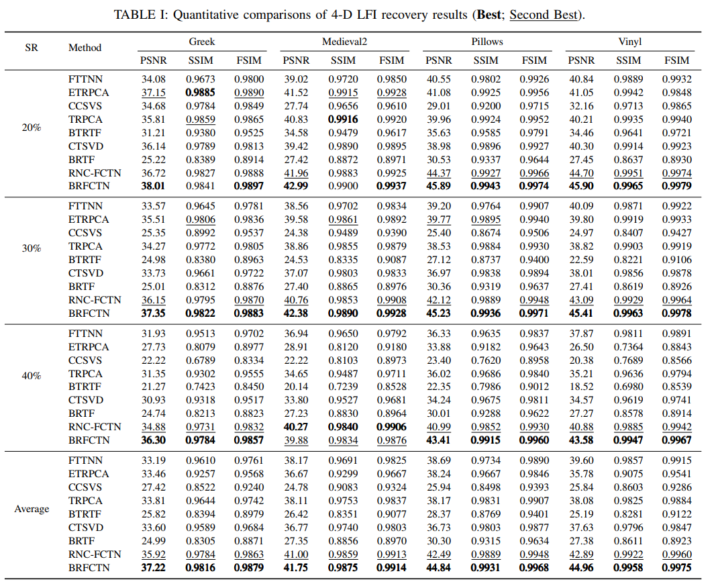
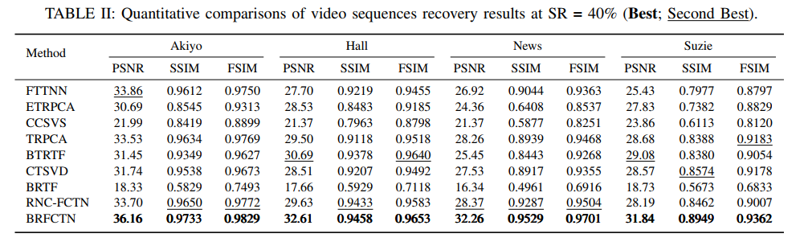
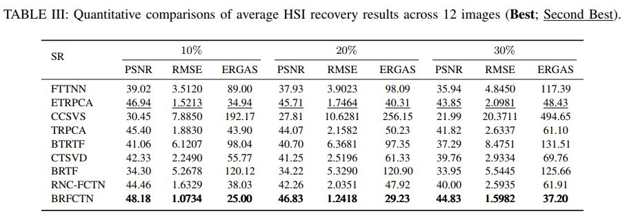
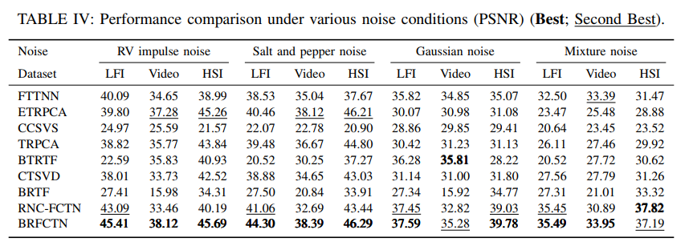

# Bayesian Robust Fully-Connected Tensor Network Decomposition for Visual Data Denoising

**Authors:** Changlong Li, Zecan Yang, Laurence T. Yang, Linsong Shan, Honglu Zhao

This repository provides a MATLAB implementation of the method proposed in our paper called BRFCTN.

## 📝 Introduction
<div align="center">

</div>

* FCTN decomposition is a new powerful decomposition firstly mentioned in **Fully-Connected Tensor Network Decomposition and Its Application to Higher-Order Tensor Completion**, which breaks through the linear
constraints of traditional approaches via its all-dimensional
interaction topology, enabling more flexible characterization
of cross-dimensional nonlinear patterns.
* Leveraging the superior representational capacity of FCTN, BRFCTN demonstrates **superior recovery performance across diverse visual datasets and multiple noise scenarios**, has better **robustness** and **effectiveness** than the recently RNC-FCTN also based on FCTN framework.

## 🚀 Getting Started
To verify the BRFCTN for data denoising, run:

```matlab
Demo
```

The code will first build the class of BRFCTN:

```matlab
FCTN_vb = FCTN_model(D, Rank, hyperparameters)
```
D is the corrupted tensor, Rank is the predefined FCTN-ranks, and hyperparameters are set as 1e-6 for non-informative prior.

Then initial the model:

```matlab
FCTN_vb = FCTN_vb.initialize()
```
  
Finally run the model:

```matlab
FCTN_vb = FCTN_vb.run(MAX_Iter)
```

## 🗂 Folder Structure
```
BRFCTN/
├── Data/        # The visual dataset used for the code, we choose HSI from CAVE dataset here. Include one representative image from CAVE called "balloons".
├── Evaluation/  # Stores functions for calculating evaluation metrics, including PSNR, SSIM, FSIM, RMSE, and ERGAS.
├── Function/    # Stores functions for higher-order tensor calculating, including contraction and tn_prod operator used in FCTN strcture.
├── Model/       # Stores the model of BRFCTN.
├── Demo.m       # A simple demo to verify the performance of BRFCTN.
└── README.md    # This file.
```


## ✅ Key Features

- Implementation of the **Bayesian Robust Fully-Connected Tensor Network(BRFCTN)** for hyperspectral and multispectral image fusion.
- Support for various visual datasets such as LFI, Video, and HSI and multiple noise scenarios (especially for mixtrue noise), which demonstrates superior rubustness.
- Leveraging the Bayesian framework, faster model learning efficiency than the recently proposed **Fully-Connected Tensor Network Decomposition for Robust Tensor Completion Problem(RNC-FCTN)**, which is also based on the FCTN framework.


## 🎖️ Main Results
<details open>
<summary><font size="4">
4-D LFI Results
</font></summary>

</details>

<details open>
<summary><font size="4">
Video Results
</font></summary>

</details>

<details open>
<summary><font size="4">
HSI from CAVE Results
</font></summary>

</details>

<details open>
<summary><font size="4">
Various Noise Type Results
</font></summary>

</details>


